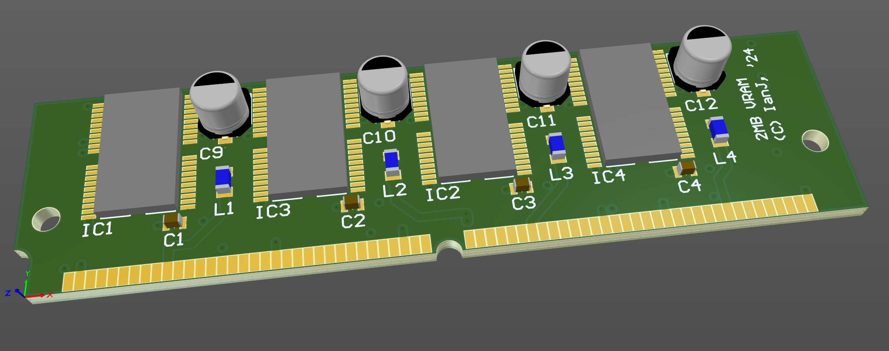

# Acorn RiscPC 1MB/2MB VRAM module

November 2024

This is my implementation of the standard RiscPC 1MB/2MB VRAM module, as per schematic and board shape in the RiscPC TRM.

This is a work in progress - not yet complete and obviously not built/tested.

## Licence

No warranty is provided, and this work is used at your own risk.  

Licenced as CC BY-SA 4.0

Copyright 2024 Ian Jeffray

